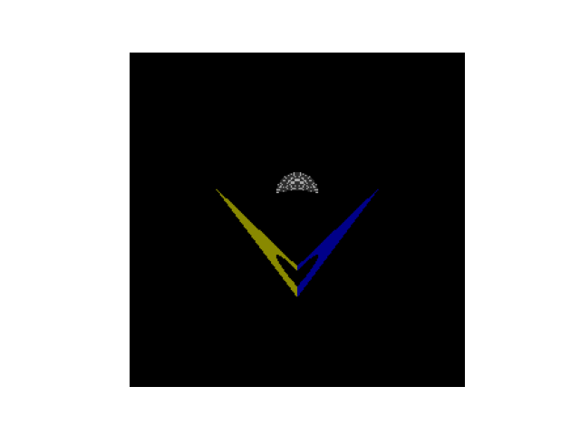
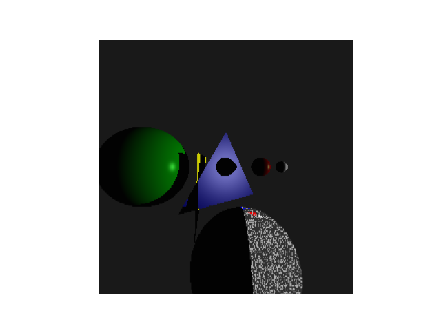

# Computer_Graphics

## Computer Graphics

In CSCI 6820, Computer Graphics, I Explored advanced concepts in 3D modeling using in Blender like camera location, light, rendering etc. Moreover, I worked on 3D projection matrix, ray tracer, and WebGL. Here are some example outputs from my project are shown below.

### Figure 1: 3D Modeling

### Figure 2: 3D Scene

### Figure 3: 3D Projection Matrix

### Figure 4: Ray Tracer
    

### Figure 5: Advanced Techniques in WebGL

