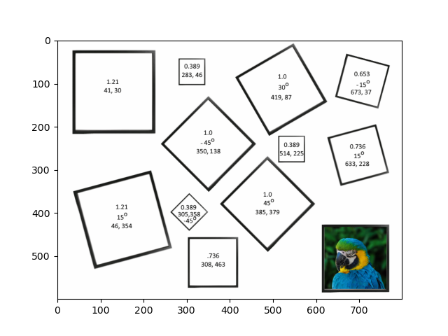

# Computer_Vision

## Digital Image Analysis and Understanding 

In DSCI 6050, Digital Image Analysis and Understanding, I did some works like Vectorization in Numpy, Image Processing, Image Transformations, Image Warping, Image Stitcher, Image Classification, and Exploration of Modern Computer Vision. Here are some example outputs from my project are shown below.

### Figure 1: Vectorization in Numpy
#### Figure 1.1: Brightness Adjust
#### Figure 1.2: Contrast Adjustment
#### Figure 1.3: Thresholding

#### Figure 1.4: Cropping
#### Figure 1.5: Scaling

### Figure 2: Image Processing
#### Figure 2.1: Convert to grayscale
#### Figure 2.2: Brightness Adjustment
#### Figure 2.3: Contrast Adjustment
#### Figure 2.4: Image Blending
  
#### Figure 2.5: Cross Dissolve
#### Figure 2.6: Uniform Blurring
#### Figure 2.7: Median Filter
#### Figure 2.8: General Convolution 
#### Figure 2.9: Sharpening
#### Figure 2.10: Edge Detection

### Figure 3: Image Transformations

### Figure 4: Image Warping
#### Figure 4.1: Interpolation
#### Figure 4.2: Backwards Mapping
#### Figure 4.3: Perspective Warp
 
#### Figure 4.4: Speed Up

### Figure 5: Image Stitcher
#### Figure 5.1: Find Interest Points/Descriptors in each Input Image
 
#### Figure 5.2: Matching Features
#### Figure 5.3: Estimating Pairwise Homographies using RANSAC
#### Figure 5.4: Creating the Mosaic

### Figure 6: Image Classification
#### Figure 6.1: Dataset
#### Figure 6.2: Neural Network Architecture
#### Figure 6.3: Training
ng
#### Figure 6.4: Testing

### Figure 7: Exploration of Modern Computer Vision
