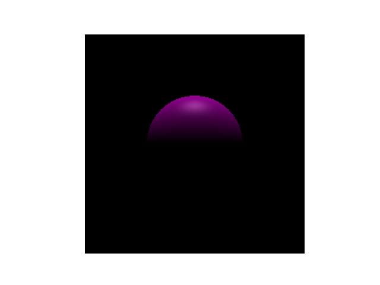
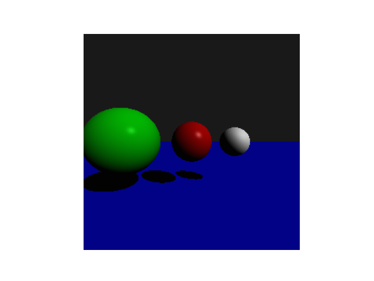
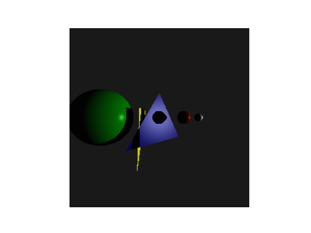
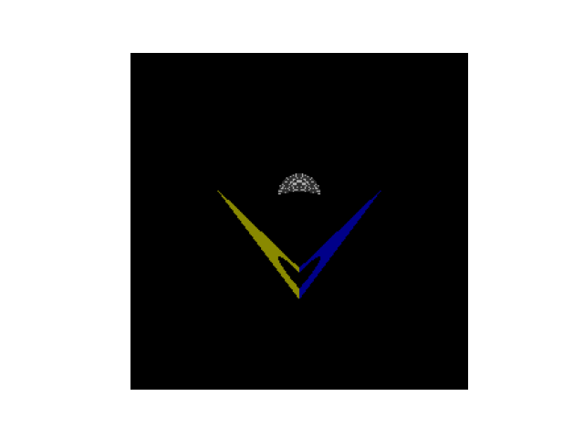

# Portfolio

## Style Transfer Research

I work with [Dr. David Hart](http://davidhartcv.com), assistant professor of computer science at East Carolina University, in the field of Computer Vision research. My thesis topic investigates different approaches to style transfer. Specifically, how different style transfer techniques are affected by different mask sizes, image statistics, etc. Here are some example outputs from my research are shown below. 

### Figure 1: Example output using the Linear Style Transfer algorithm for a full image.
.jpg>)

### Figure 2: Example output using the Linear Style Transfer algorithm for a full image, followed by masking.
.jpg>)

### Figure 3: Example output using a Partial Convolution algorithm for style transfer.
.jpg>)

### Figure 4: Comparison  of multiple techniques.
.jpg>)

Code and additional examples can be found in the folder "Style Transfer Research"

## Computer Graphics

In CSCI 6820, Computer Graphics, I Explored advanced concepts in 3D modeling using in Blender like camera location, light, rendering etc. Moreover, I worked on 3D projection matrix, ray tracer, and WebGL. Here are some example outputs from my project are shown below.

### Figure 1: 3D Modeling

### Figure 2: 3D Scene

### Figure 3: 3D Projection Matrix

### Figure 4: Ray Tracer
    

### Figure 5: Advanced Techniques in WebGL

Code and additional examples can be found in the folder "Computer Graphics"

## Computer Vision

In DSCI 6050, Digital Image Analysis and Understanding, I did some works like Vectorization, Image Processing, Image Transformations, Image Warping, Image Stitcher, Image Classification, and Exploration of Modern Computer Vision. Here are some example outputs from my project are shown below.