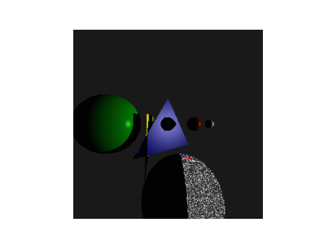

# Portfolio

## Style Transfer Research

I work with [Dr. David Hart](http://davidhartcv.com), assistant professor of computer science at East Carolina University, in the field of Computer Vision research. My thesis topic investigates different approaches to style transfer and integrating the Segment Anything Model with style transfer. Specifically, it proposes Partial Convolution as a way to improve style transfer for segmented regions. Additionally, how different style transfer techniques are affected by different mask sizes, image statistics, etc. Example outputs from my research are shown below. Code is provided, but some content is removed that is related to our unpublished results.

### Figure 1: Example output using the Segment Anything Model. Given an input image (left) and a point from the user, the model can determine all pixels associated with the object closest surrounding that point, providing a mask of the object (right).

### Figure 2: Example output using the Linear Style Transfer algorithm for a full image.  A content and style image (left) are fed into the style transfer network, resulting in stylized version of the content image (right).

### Figure 3: Example output using a Partial Convolution algorithm for style transfer. A content, style image (left) and a given masked object (the bird), the partial convolution style transfer algorithm can apply the stylization to the masked region exclusively (right).

### Figure 4: Example output using the Linear Style Transfer algorithm for a full image, followed by masking (Style-then-Mask). A content image and style image (left) give the following stylized output for the masked region (right). The result stylization tends to be darker than the input style features.

### Figure 5: Example output using the Linear Style Transfer algorithm for a full image, followed by masking (Mask-then-Style). A content image and style image (left) give the following stylized output for the masked region (right). The result stylization tends to be much brighter than the input style features.

### Figure 6: Example output using the Partial Convolution algorithm. A content image and style image (left) give the following stylized output for the masked region (right). The result stylization tends to be closer to the input style features than the other two approaches.

### Figure 7: Comparison of the three techniques: style-then-mask (left), mask-then-style (middle), partial convolution (right). A content image and style image (top) give the following stylized output for the masked region (bottom).

Code and additional examples can be found in the folder "Style Transfer Research"

## Computer Graphics

In CSCI 6820, Computer Graphics, I Explored advanced concepts in 3D modeling using in Blender like camera location, light, rendering etc. Moreover, I worked on 3D projection matrix, ray tracer, and WebGL. Here are some example outputs from my project are shown below.

### Figure 1: 3D Modeling

### Figure 2: 3D Scene

### Figure 3: 3D Projection Matrix

### Figure 4: Ray Tracer
    

### Figure 5: Advanced Techniques in WebGL

Code and additional examples can be found in the folder "Computer Graphics"

## Computer Vision

In DSCI 6050, Digital Image Analysis and Understanding, I did some works like Vectorization in Numpy, Image Processing, Image Transformations, Image Warping, Image Stitcher, Image Classification, and Exploration of Modern Computer Vision. Here are some example outputs from my project are shown below.

### Figure 1: Vectorization in Numpy
#### Figure 1.1: Brightness Adjust
#### Figure 1.2: Contrast Adjustment
#### Figure 1.3: Thresholding

#### Figure 1.4: Cropping
#### Figure 1.5: Scaling

### Figure 2: Image Processing
#### Figure 2.1: Convert to grayscale
#### Figure 2.2: Brightness Adjustment
#### Figure 2.3: Contrast Adjustment
#### Figure 2.4: Image Blending
  
#### Figure 2.5: Cross Dissolve
#### Figure 2.6: Uniform Blurring
#### Figure 2.7: Median Filter
#### Figure 2.8: General Convolution 
#### Figure 2.9: Sharpening
#### Figure 2.10: Edge Detection

### Figure 3: Image Transformations

### Figure 4: Image Warping
#### Figure 4.1: Interpolation
#### Figure 4.2: Backwards Mapping
#### Figure 4.3: Perspective Warp
 
#### Figure 4.4: Speed Up

### Figure 5: Image Stitcher
#### Figure 5.1: Find Interest Points/Descriptors in each Input Image
 
#### Figure 5.2: Matching Features
#### Figure 5.3: Estimating Pairwise Homographies using RANSAC
#### Figure 5.4: Creating the Mosaic

### Figure 6: Image Classification
#### Figure 6.1: Dataset
#### Figure 6.2: Neural Network Architecture
#### Figure 6.3: Training
ng
#### Figure 6.4: Testing

### Figure 7: Exploration of Modern Computer Vision

Code and additional examples can be found in the folder "Computer Vision"